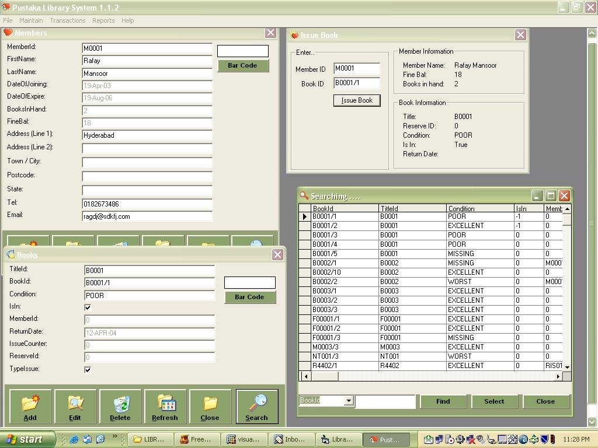



## Library System 112

### Description

Basic library system based on one by Abdul Rafay Mansoor which contains: titles, books, members, employees, borrow books, return books, renew books, missing books, and pay fines. I have added open database (MS Access) file (for network environment), employee log in, lookup search function (uses ado in a single form), and bigger buttons. This is still in progress, appreciate feedback and suggestions.
 
### More Info
 

             |
---                |---
**Submitted On**   |2004-02-03 23:16:48
**By**             |[Raja Iskandar Shah](https://github.com/Planet-Source-Code/PSCIndex/blob/master/ByAuthor/raja-iskandar-shah.md)
**Level**          |Intermediate
**User Rating**    |4.4 (40 globes from 9 users)
**Compatibility**  |VB 6\.0
**Category**       |[Complete Applications](https://github.com/Planet-Source-Code/PSCIndex/blob/master/ByCategory/complete-applications__1-27.md)
**World**          |[Visual Basic](https://github.com/Planet-Source-Code/PSCIndex/blob/master/ByWorld/visual-basic.md)
**Archive File**   |[Library\_Sy170476262004\.zip](https://github.com/Planet-Source-Code/raja-iskandar-shah-library-system-112__1-51530/archive/master.zip)

